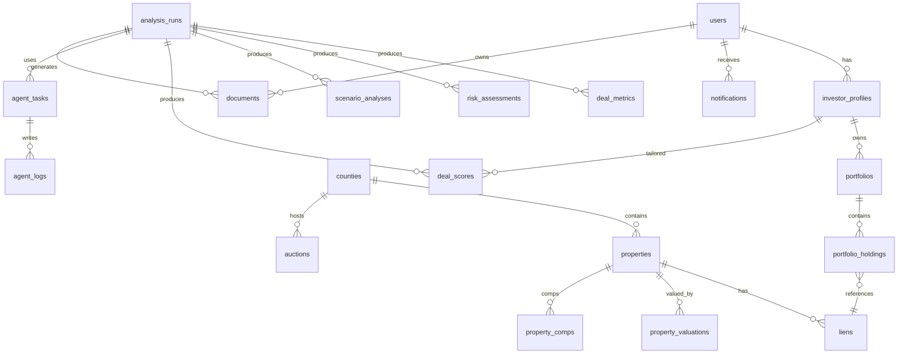

# Data Model – Tax Lien Strategist App
## Comprehensive Entity & Schema Architecture

This document defines the **complete data model** for the Tax Lien Strategist App, designed to support AGI-driven agentic workflows, large-scale property and lien ingestion, deterministic financial analysis, scenario modeling, and investor portfolio management.

---
# 1. Core Domain Entities

## 1.1 `users`
Represents application accounts.
- id (PK)
- email (unique)
- password_hash
- role (enum: investor, admin, analyst)
- created_at
- updated_at
- is_active (bool)

## 1.2 `investor_profiles`
Investor-specific parameters.
- id (PK)
- user_id (FK → users.id)
- display_name
- investment_budget_total
- min_target_yield
- max_risk_score
- preferred_states (array/text)
- time_horizon_months
- strategy_type (enum: yield, equity, balanced)
- created_at
- updated_at

---
# 2. Jurisdictions, Properties & Liens

## 2.1 `counties`
- id (PK)
- state_code
- county_name
- auction_type (tax_lien, tax_deed, hybrid)
- timezone
- data_source_url
- created_at
- updated_at

## 2.2 `properties`
- id (PK)
- county_id (FK)
- apn (parcel number)
- street_address
- city
- state
- zip_code
- lat
- lng
- property_type (sfh, mfh, land, commercial, industrial, mixed_use, other)
- land_sqft
- building_sqft
- year_built
- zoning
- last_updated_at

## 2.3 `auctions`
- id (PK)
- county_id (FK)
- auction_name
- auction_date
- auction_type (in_person, online, hybrid)
- source_url
- status (scheduled, completed, canceled)
- created_at
- updated_at

## 2.4 `liens`
- id (PK)
- property_id (FK)
- auction_id (FK, nullable)
- lien_certificate_number
- lien_type (tax_lien, tax_deed, other)
- lien_principal_amount
- interest_rate_nominal
- interest_type (simple, penalty, compound, stepped)
- redemption_period_months
- issue_date
- redemption_deadline
- status (available, sold, redeemed, foreclosed, canceled)
- current_holder (nullable)
- created_at
- updated_at

---
# 3. Market & Valuation Data

## 3.1 `property_valuations`
- id (PK)
- property_id (FK)
- valuation_date
- avm_value
- low_value
- high_value
- valuation_source (mls, zillow, attom, internal_model)
- confidence_score
- created_at

## 3.2 `property_comps`
- id (PK)
- property_id (FK)
- comp_property_address
- comp_sale_price
- comp_sale_date
- distance_miles
- similarity_score
- source
- created_at

---
# 4. Analysis & Scenario Modeling

## 4.1 `analysis_runs`
Represents one computation cycle (e.g., "Analyze County X").
- id (PK)
- investor_profile_id (nullable FK)
- initiated_by_user_id (nullable FK)
- analysis_type (county_batch, portfolio_rebalance, single_lien, watchlist_refresh)
- target_county_id (nullable FK)
- status (pending, running, completed, failed)
- started_at
- completed_at
- error_message
- created_at

## 4.2 `deal_metrics`
Deterministic financial computations per lien.
- id (PK)
- analysis_run_id (FK)
- lien_id (FK)
- property_id (FK)
- valuation_id (FK, nullable)
- lien_to_value_ratio
- estimated_redemption_hold_months
- simple_yield
- annualized_yield
- cash_on_cash_return
- irr_redemption_scenario
- irr_deed_scenario
- expected_value_overall
- liquidity_score
- created_at

## 4.3 `risk_assessments`
- id (PK)
- analysis_run_id (FK)
- lien_id (FK)
- property_id (FK)
- title_risk_score
- structural_risk_score
- neighborhood_risk_score
- vacancy_risk_score
- legal_complexity_risk_score
- overall_risk_score
- risk_flags (jsonb)
- created_at

## 4.4 `scenario_analyses`
- id (PK)
- analysis_run_id (FK)
- lien_id (FK)
- scenario_type (redemption, deed_conversion, assignment_resell)
- probability
- projected_profit
- projected_roi
- projected_irr
- holding_period_months
- total_capital_required
- notes
- created_at

## 4.5 `deal_scores`
Ranked scores for investor.
- id (PK)
- analysis_run_id (FK)
- investor_profile_id (FK)
- lien_id (FK)
- composite_score
- yield_score
- risk_adjusted_return_score
- liquidity_score
- strategy_fit_score
- rank_within_run
- created_at

---
# 5. Portfolios

## 5.1 `portfolios`
- id (PK)
- investor_profile_id (FK)
- name
- description
- created_at
- updated_at

## 5.2 `portfolio_holdings`
- id (PK)
- portfolio_id (FK)
- lien_id (FK)
- acquisition_date
- acquisition_price
- current_status (held, redeemed, foreclosed, sold_assignment, written_off)
- redemption_amount_received
- foreclosure_date
- disposition_date
- disposition_proceeds
- created_at
- updated_at

---
# 6. AGI / Agent Operations

## 6.1 `agent_tasks`
- id (PK)
- analysis_run_id (FK, nullable)
- parent_task_id (nullable FK → agent_tasks.id)
- agent_type (orchestrator, research, underwriting, document)
- task_name
- status (pending, in_progress, completed, failed)
- input_payload (jsonb)
- output_payload (jsonb)
- error_message
- started_at
- completed_at
- created_at

## 6.2 `agent_logs`
- id (PK)
- agent_task_id (FK)
- log_type (plan, step, error, summary)
- content (text/jsonb)
- created_at

## 6.3 `embeddings`
- id (PK)
- entity_type (property, lien, county, document, analysis_summary)
- entity_id
- embedding_vector
- model_name
- created_at

---
# 7. Documents & Notifications

## 7.1 `documents`
- id (PK)
- owner_user_id (FK)
- portfolio_id (FK, nullable)
- analysis_run_id (FK, nullable)
- lien_id (FK, nullable)
- document_type (investor_summary, promissory_note, foreclosure_packet, portfolio_report, other)
- storage_url
- mime_type
- generated_by_agent_task_id (FK nullable)
- created_at

## 7.2 `notifications`
- id (PK)
- user_id (FK)
- notification_type
- title
- body
- metadata (jsonb)
- is_read
- created_at
- read_at

---
# 8. Integration & Audit

## 8.1 `integration_events`
- id (PK)
- source_system (county, mls, gis, auction_platform, other)
- request_payload (jsonb)
- response_payload (jsonb)
- status (success, failed)
- error_message
- started_at
- completed_at

## 8.2 `audit_logs`
- id (PK)
- user_id (FK, nullable)
- event_type
- entity_type
- entity_id
- description
- created_at

---
# 9. ER Diagram (Mermaid)

---
# End of Data Model