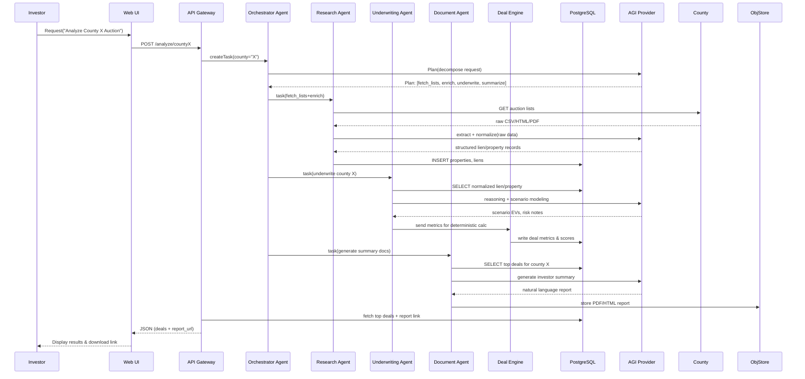
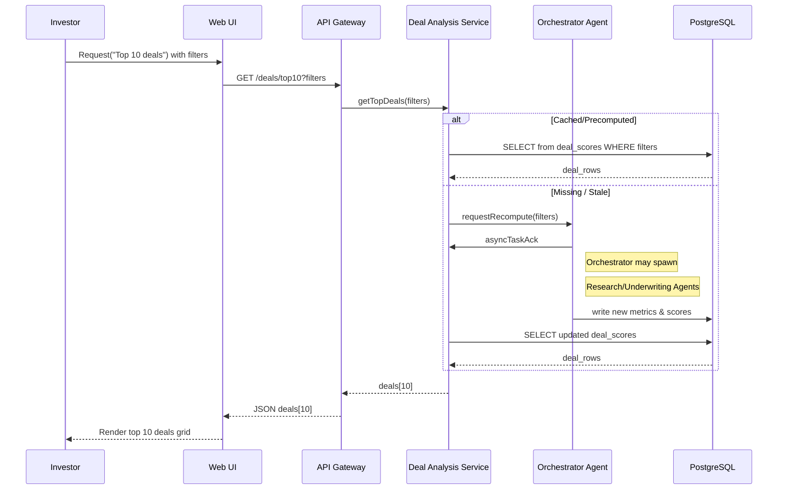
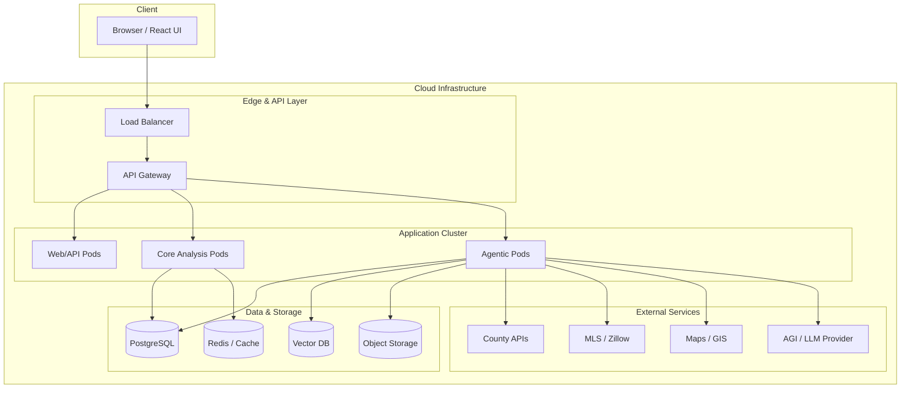

# Diagram Suite – AGI/Agentic System for Tax Lien Strategist App

This document contains a set of text-based diagrams (Mermaid & UML-style) that can be rendered in compatible tools.

---
## 1. High-Level Architecture (Component + Layers)
```mermaid
flowchart TB
    subgraph UI[User & UI Layer]
        Investor[Investor / User]
        WebUI[Web UI (Next.js/React)]
    end

    subgraph API[API Gateway / BFF]
        APIGW[API Gateway (FastAPI/Node)]
    end

    subgraph CORE[Core Analysis Layer]
        DealEng[Deal Analysis Engine]
        RiskEng[Risk Intelligence Engine]
        PortMgr[Portfolio Manager]
    end

    subgraph AGI[Agentic Intelligence Layer]
        Orchestrator[Orchestrator Agent]
        ResearchA[Autonomous Research Agent]
        UnderwriterA[Underwriting Agent]
        DocA[Document Agent]
    end

    subgraph DATA[Data Persistence Layer]
        DB[(PostgreSQL)]
        VecDB[(Vector DB)]
        Cache[(Redis)]
        ObjStore[(Object Storage)]
    end

    subgraph EXT[External Systems]
        County[County / Tax Data]
        MLS[MLS / Zillow / ATTOM]
        Maps[GIS / Maps]
        AGIAPI[AGI / LLM Provider]
        Notif[Email / SMS / In-App]
    end

    Investor --> WebUI --> APIGW

    APIGW --> DealEng
    APIGW --> RiskEng
    APIGW --> PortMgr
    APIGW --> Orchestrator

    Orchestrator --> ResearchA
    Orchestrator --> UnderwriterA
    Orchestrator --> DocA

    ResearchA --> County
    ResearchA --> MLS
    ResearchA --> Maps

    Orchestrator --> AGIAPI
    ResearchA --> AGIAPI
    UnderwriterA --> AGIAPI
    DocA --> AGIAPI

    DealEng --> DB
    RiskEng --> DB
    PortMgr --> DB
    Orchestrator --> DB
    ResearchA --> DB

    Orchestrator --> VecDB
    ResearchA --> VecDB
    UnderwriterA --> VecDB
    DocA --> VecDB

    CORE --> Cache
    AGI --> Cache

    DocA --> ObjStore

    PortMgr --> Notif
    DocA --> Notif
```

---
## 2. Detailed Component Diagram (UML-Style Text)

```text
+---------------------------------------------------------+
|                 Tax Lien Strategist System              |
+---------------------------------------------------------+
| Components:                                             |
|  - WebUI (Next.js/React)                               |
|  - API Gateway (FastAPI/Node)                          |
|  - DealAnalysisService                                 |
|  - RiskEngineService                                   |
|  - PortfolioService                                    |
|  - AgentOrchestrator                                   |
|  - ResearchAgent                                       |
|  - UnderwritingAgent                                   |
|  - DocumentAgent                                       |
|  - Persistence Layer (PostgreSQL, Redis, S3, VectorDB) |
+---------------------------------------------------------+

[WebUI] --HTTP/JSON--> [API Gateway]
[API Gateway] --gRPC/REST--> [DealAnalysisService]
[API Gateway] --gRPC/REST--> [RiskEngineService]
[API Gateway] --gRPC/REST--> [PortfolioService]
[API Gateway] --gRPC/REST--> [AgentOrchestrator]

[AgentOrchestrator] --Tasks--> [ResearchAgent]
[AgentOrchestrator] --Tasks--> [UnderwritingAgent]
[AgentOrchestrator] --Tasks--> [DocumentAgent]

[ResearchAgent] --HTTP--> [County/APIs]
[ResearchAgent] --HTTP--> [MLS/ATTOM]
[ResearchAgent] --HTTP--> [GIS/Maps]

[All Agents] --LLM Calls--> [AGI Provider]

[DealAnalysisService] --SQL--> [PostgreSQL]
[RiskEngineService] --SQL--> [PostgreSQL]
[PortfolioService] --SQL--> [PostgreSQL]
[Agents] --SQL--> [PostgreSQL]

[Agents] --Vector Ops--> [VectorDB]
[Core Services] --Cache--> [Redis]
[DocumentAgent] --PUT/GET--> [Object Storage]
```

---
## 3. Sequence Diagram – "Analyze New County Auction"



---
## 4. Sequence Diagram – "Investor Requests Top 10 Deals"



---
## 5. Deployment Diagram

```text
+-----------------------------+          +-----------------------------+
|        User Environment     |          |       Cloud Environment     |
+-----------------------------+          +-----------------------------+
|  Browser / Client           |          |  Region: us-central-1       |
|  - React/Next.js UI         |          |                             |
+--------------+--------------+          +---------------+-------------+
               | HTTP(S)                                 |
               v                                         v
       +-------+-----------------------------+   +-------+--------------------+
       |        API / Edge Layer             |   |  External Services        |
       |  - API Gateway / Load Balancer      |   |  - County APIs            |
       |  - Auth / Rate Limiting             |   |  - MLS/ATTOM/Zillow       |
       +----------------------+--------------+   |  - Maps / GIS             |
                              |                  |  - AGI / LLM Provider     |
                              v                  +---------------------------+
         +--------------------+---------------------------------------------+
         |                 Application Cluster                              |
         |  - Web/API Pods (FastAPI/Node)                                   |
         |  - Core Services Pods (Deal, Risk, Portfolio)                    |
         |  - Agentic Pods (Orchestrator, Research, Underwriting, Document) |
         +--------------------+--------------------+------------------------+
                              |                    |
                              |                    |
            +-----------------+----+         +-----+----------------------+
            | Data Cluster          |         | Eventing & Cache Layer    |
            | - PostgreSQL (RDS)    |         | - Redis                   |
            | - Vector DB           |         | - Message Broker (Kafka)  |
            | - Object Storage (S3) |         +---------------------------+
            +-----------------------+
```

---
## 6. Deployment Diagram (Mermaid Version)


---
## 7. How to Use These Diagrams
- **Mermaid blocks** can be pasted directly into Mermaid-compatible editors (e.g., Markdown previewers, VSCode extensions, Mermaid Live Editor).
- **UML-style text diagrams** can be imported or translated into tools such as PlantUML, Lucidchart, or Draw.io.
- The diagrams are designed to be consistent with the previously defined system architecture, DFDs, and whitepaper.

---
**End of Diagram Suite**

